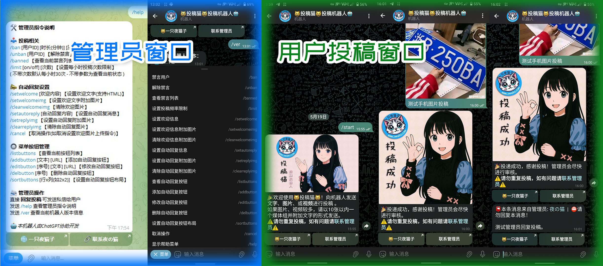

# 😺投稿猫😺 - Telegram 投稿机器人



这是一个使用 polling + systemd 启动方式，支持文字、图片、视频、媒体组投稿，并将投稿转发给管理员审核的 Telegram 投稿机器人。

---

## ✨ 基础功能

✅ 用户通过给机器人发送消息进行投稿，机器人将投稿消息转发给管理员（支持媒体组形式）。投稿成功后会收到自动回复（媒体组只回复一次）。  
✅ 机器人转发的消息内嵌投稿人昵称与 Telegram ID，点击昵称可查看资料，点击 ID 可复制。  
✅ 管理员可通过回复投稿内容给投稿者发送私信（媒体组需对首条媒体回复）。  
✅ 投稿禁言功能，管理员可设置禁言时长（1 分钟～永久），可附加禁言原因。支持查看、修改、解除禁言。被禁言用户投稿时会收到提示。  
✅ 支持自定义欢迎消息和自动回复内容，可设置图文形式，并添加可点击超链接按钮（支持排序与布局调整）。  
✅ 投稿频率限制功能（默认关闭），管理员可开启此功能并设置每小时允许投稿次数。超出后用户将收到提醒。  
✅ 管理员可见的聊天框功能菜单，包含完整指令帮助 `/help`；投稿用户无法看到管理员菜单。

---

## 📁 文件结构

```yaml
/root/telegram_bot/imneko_bot/
├── imneko_bot.py # 主程序文件（投稿逻辑、指令监听等）
├── safe_send.py # 安全发送封装函数，避免网络延迟导致程序崩溃并通知管理员
├── config.json # 配置文件（包含 token、管理员 ID、欢迎语、按钮设置等）
├── blacklist.json # 储存被禁言用户的记录：ID、昵称、禁言时间与原因
├── welcome.jpg # 可选 /start 欢迎图片
├── reply_banner.jpg # 可选 投稿成功后图文自动回复图片
├── requirements.txt # 项目依赖清单（推荐使用 pip 一键安装）
├── imneko_bot.service # systemd 后台服务文件（可选）
```
---

## 🚀 安装部署步骤（适用于 Linux / VPS 环境）

### 1. 安装 Python 与虚拟环境工具
```bash
sudo apt update
sudo apt install -y python3 python3-venv python3-pip git unzip curl
```

### 2. 准备机器人目录并上传文件
```bash
mkdir -p /root/telegram_bot/imneko_bot
cd /root/telegram_bot/imneko_bot
```
✅ 请将路径替换为你实际的安装目录与用户名。

### 3. 创建虚拟环境并激活
```bash
python3 -m venv venv
source venv/bin/activate
```

### 4. 安装依赖库
```bash
pip install -r requirements.txt
```

### 5. 配置机器人信息（编辑 config.json）
```json
{
  "token": "你的机器人 token（从 @BotFather 获取）",
  "admin_id": "你的 Telegram 数字 ID（通过 @userinfobot 获取）"
}
```

### 6. 启动机器人（测试阶段使用）
```bash
python3 imneko_bot.py
```

---

## ⚙️ 后台运行（使用 systemd）

### 1. 创建或软连接 systemd 服务文件（/etc/systemd/system/imneko_bot.service）
```ini
[Unit]
Description=😺投稿猫😺 Telegram 投稿机器人
After=network.target

[Service]
User=root
WorkingDirectory=/root/telegram_bot/imneko_bot
ExecStart=/root/telegram_bot/imneko_bot/venv/bin/python3 /root/telegram_bot/imneko_bot/imneko_bot.py
Restart=always

[Install]
WantedBy=multi-user.target
```
✅ 请将路径替换为你实际的安装目录与用户名。

### 2. 启用并启动服务
```bash
sudo systemctl daemon-reload
sudo systemctl enable imneko_bot.service
sudo systemctl start imneko_bot.service
```
### 3. 查看运行状态或日志
```bash
sudo systemctl status imneko_bot.service
journalctl -u imneko_bot.service -n 50 --no-pager
```

---

## 🔧 配置字段说明（config.json）
| 字段名               | 类型  | 说明                                            |
| ----------------- | --- | --------------------------------------------- |
| `token`           | 字符串 | Bot 的 Token（在 @BotFather 创建后获取）               |
| `admin_id`        | 字符串 | 管理员的 Telegram ID                              |
| `welcome_message` | 字符串 | /start 欢迎语（支持 HTML 格式）                        |
| `auto_reply`      | 字符串 | 投稿成功后的自动回复（支持 HTML）                           |
| `welcome_buttons` | 数组  | 欢迎消息下方的按钮（支持 text 和 url）                      |
| `post_limit`      | 对象  | 投稿频率限制配置，如 `{ "enabled": true, "count": 30 }` |
| `button_layout`   | 对象  | 按钮布局控制，例如 `{ "row": 1, "col": 2 }`            |

✅除了 token 和 admin_id 外，管理员都可以通过机器人命令更改

---

## 🧪 测试 & 演示
😺 投稿猫 - Telegram 投稿机器人：
🔗 https://t.me/imnekobot

---

## 🧠 作者
夜の猫 (由ChatGPT协助开发) <br>
Telegram: @imnekosama <br>
网站：🌐 https://imneko.com

